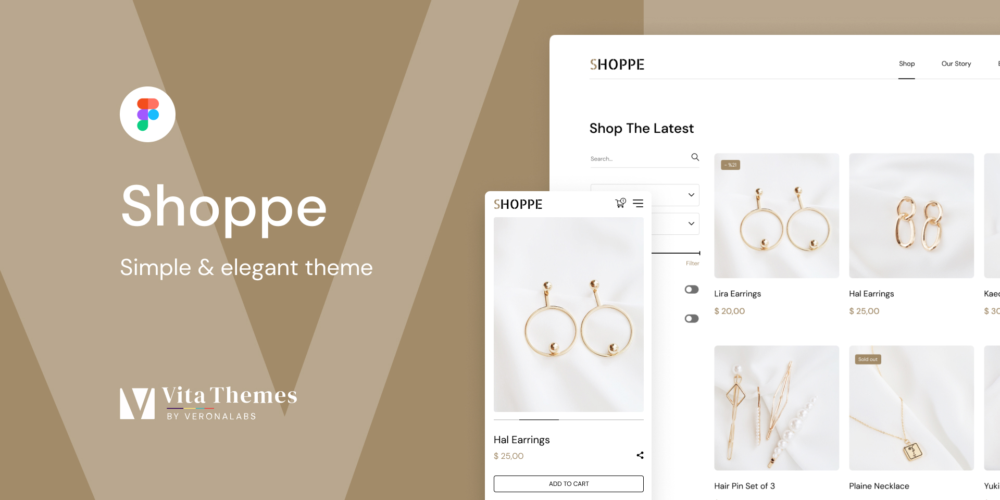

# Progetto di squadra **Shoppe Store** | Vanilla JS

&nbsp;

# Link al progetto [**ShoppeStore.com.ua**](https://shoppestore.netlify.app 'Vai alla pagina del progetto')

&nbsp;

## Progetto di gruppo

&nbsp;

| PARTECIPANTI                                                                                                 | RUOLI                                                               |
| ------------------------------------------------------------------------------------------------------------ | ------------------------------------------------------------------- |
| <span style="font-size:20px">[**Vasyl Verbytskyi**](https://github.com/San88Francisco 'Vai a GitHub')</span> | <span style="font-size:20px">**Lead Software Developer**</span>     |
| <span style="font-size:20px">[**Roman Vasylenko**](https://github.com/Akumuuu 'Vai a GitHub')</span>         | <span style="font-size:20px">**Lead Software Developer**</span>     |
| <span style="font-size:20px">[**Ivan Yakovchuk**](https://github.com/YakovchukIvan 'Vai a GitHub')</span>    | <span style="font-size:20px">**Frontend Software Developer**</span> |
| <span style="font-size:20px">[**Danylo Glusov**](https://github.com/Xlussov 'Vai a GitHub')</span>           | <span style="font-size:20px">**Frontend Software Developer**</span> |
| <span style="font-size:20px">[**Andrii Dmytruk**](https://github.com/admitruk237 'Vai a GitHub')</span>      | <span style="font-size:20px">**Frontend Software Developer**</span> |
| <span style="font-size:20px">[**Andriy Potapov**](https://github.com/AndrijPot 'Vai a GitHub')</span>            | <span style="font-size:20px">**Frontend Software Developer**</span> |
| <span style="font-size:20px">[**Denys Levchenko**](https://github.com/gitdenlev 'Vai a GitHub')</span>       | <span style="font-size:20px">**Frontend Software Developer**</span> |
| <span style="font-size:20px">[**Denys Tkachenko**](https://github.com/Tkachenko01001 'Vai a GitHub')</span>  | <span style="font-size:20px">**Frontend Software Developer**</span> |
| <span style="font-size:20px">[**Volodymyr Kirilyuk**](https://github.com/ZD-Donatik 'Vai a GitHub')</span>   | <span style="font-size:20px">**Frontend Software Developer**</span> |

&nbsp;

## Collegamento al progetto in Figma

[](<https://www.figma.com/file/yYKzT2pnaAR7UVJQKVhGJz/Shoppe-(Community)-(Copy)?type=design&node-id=1908-2067&mode=design&t=uM9WecxIjNGtVyRj-0> 'Vai al progetto')

&nbsp;

## Il progetto

&nbsp;

### [**Shoppe Store**](https://gleeful-faloodeh-752787.netlify.app/ 'Vai al sito web del progetto") è un progetto di beneficenza in cui sono state utilizzate solo tecnologie standard per lo sviluppo di siti web, ovvero - <u>**HTML**</u>, <u>**CSS**</u> e <u>**JAVASCRIPT**</u>.

### Caratteristiche speciali

<ol style='font-size:18px; font-weight: 500'>
    <li><span style="font-size:18px"><b>Cooperazione:</b></span>
        <ul>
            <li style="font-size:16px">Riunioni quotidiane per discutere i compiti.</li>
            <li style="font-size:16px">Utilizzo di Trello per organizzare i compiti.</li>
        </ul>
    </li>
    <li><span style="font-size:18px">Divisione dei compiti:</span>
        <ul>
            <li style="font-size:16px">I compiti sono stati assegnati in base alla loro difficoltà.</li>
            <li style="font-size:16px">Un maggior numero di persone è stato coinvolto in compiti più complessi.</li>
        </ul>
    </li>
    <li><span style="font-size:18px">Codice pulito:</span>
        <ul>
            <li style="font-size:16px; text-decoration: underline">L'intero progetto è stato scritto senza l'uso di librerie o framework (con l'eccezione di SASS).</li>
        </ul>
    </li>
    <li><span style="font-size:18px">Revisione del codice:</span>
        <ul>
            <li style="font-size:16px">Ogni nuovo compito è stato assegnato su una pagina separata.</li>
            <li style="font-size:16px">I membri del team hanno avuto l'opportunità di lavorare con il codice di altre persone e di affinare le loro capacità di revisione.</li>
        </ul>
    </li>
    <li><span style="font-size:18px">Github:</span>
        <ul>
            <li style="font-size:16px">Lo sviluppo e il controllo del progetto si sono svolti sulla piattaforma Github.</li>
            <li style="font-size:16px">Per ogni compito è stato utilizzato un ramo separato.</li>
            <li style="font-size:16px">I leader hanno controllato regolarmente il codice e hanno unito i rami.</li>
            <li style="font-size:16px">I leader hanno insegnato ai partecipanti al team ad aggiornare la propria branca con la principale prima di apportare modifiche.</li>
        </ul>
    </li>
</ol>

## Valore del progetto:

### L'obiettivo principale era quello di migliorare le competenze nella creazione di siti web multifunzionali in puro JavaScript.

### Questo progetto è un ottimo esempio di lavoro di squadra, di abilità di codifica e di capacità di apprendimento. È diventato un'esperienza preziosa per tutti coloro che ci hanno lavorato.

### <u>**Tutte le funzionalità del sito sono state implementate senza utilizzare librerie o framework**</u> L'unica eccezione è stata l'uso del preprocessore SASS.

### È stata utilizzata una configurazione personalizzata che combina Webpack e Gulp per comprendere meglio i diversi tipi di configurazione.

#### Per iniziare, è necessario installare i pacchetti del modulo:

```
npm install
```

#### Poi lanciamo il progetto:

```
npm run dev
```

## &nbsp;


&nbsp;

&nbsp;

# Grazie per il vostro tempo!
